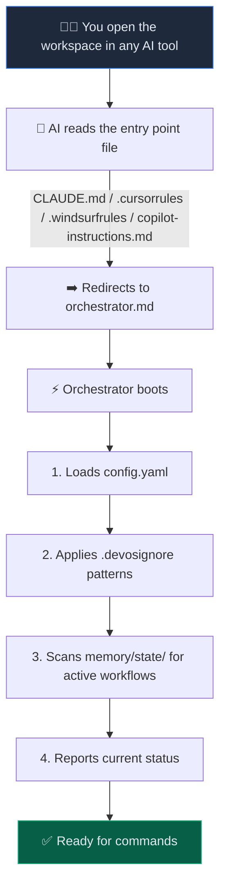
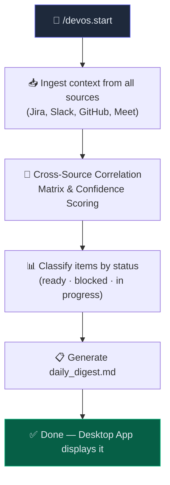
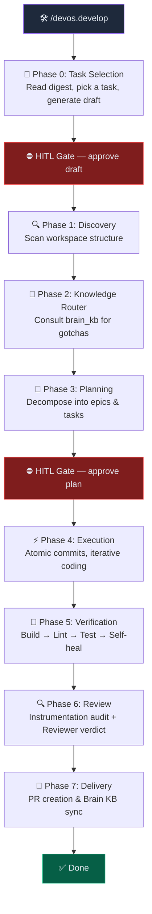
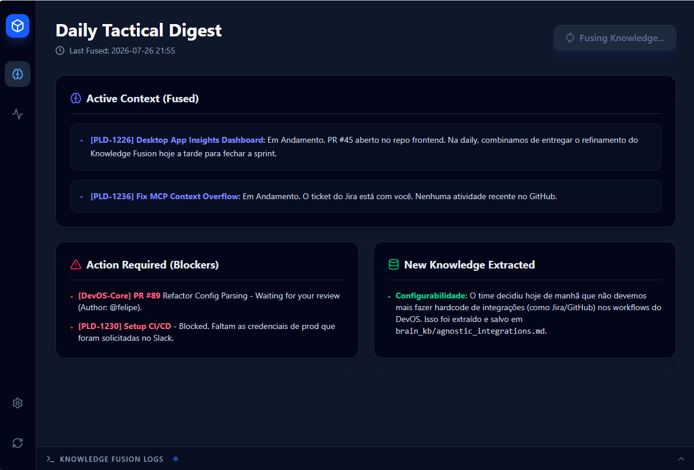

<div align="center">

# ⚡ DevOS

**The filesystem-first autonomous development framework.**

Orchestrate agentic workflows across your entire workspace — with any AI tool, zero dependencies, and full human control.

[](LICENSE)
[](#-quick-start)
[](#)
[](#-philosophy)

<br />

[Quick Start](#-quick-start) · [How It Works](#-how-it-works) · [Commands](#-commands) · [Architecture](#-architecture) · [Desktop App](#-control-plane-desktop-app) · [Extend](#-extending-devos)

<br />

</div>

---

## 😤 The Problem

You open your AI coding tool, and the first 10 minutes are always the same:

> *"Here's the Jira ticket, here's the Slack thread, here's what we discussed in the meeting, here's the PR that's blocking us, and oh — remember that bug we hit last month with the auth flow? Don't make that mistake again."*

Every session starts from zero. Context is scattered across Jira, Slack, GitHub, meeting transcripts, and your own memory. The AI doesn't know what happened yesterday. It doesn't know what your team decided. And if it runs unchecked, it will happily repeat the same architectural mistakes you fixed last sprint.

**DevOS fixes this.**

It turns your filesystem into a persistent, structured brain for AI-driven development — so your agent wakes up already knowing what matters, what to avoid, and what to do next.

---

## ✨ Key Features

<table>
<tr>
<td width="50%">

### 🧠 Accumulative Memory
Every completed workflow writes lessons learned, gotchas, and conventions to a persistent **Brain KB**. Your AI reviewer cross-references past mistakes before every code review — so traps are never repeated.

</td>
<td width="50%">

### 🔄 Resumable Workflows
State lives in files, not chat history. Close your terminal, switch tools, come back next week — DevOS picks up exactly where you left off.

</td>
</tr>
<tr>
<td width="50%">

### 🛡️ Human-in-the-Loop Gates
Every major phase transition requires your explicit approval. DevOS proposes, you decide. No autonomous runaway.

</td>
<td width="50%">

### 🌐 Multi-Source Context Fusion
Ingest and correlate signals from Jira, Slack, GitHub, and meeting transcripts — automatically. One command gives the AI everything it needs.

</td>
</tr>
<tr>
<td width="50%">

### 🧩 AI-Agnostic
Works with Claude Code, Cursor, Gemini CLI, Windsurf, GitHub Copilot — any LLM that can read files. No vendor lock-in.

</td>
<td width="50%">

### 📦 Zero Dependencies
The entire framework is Markdown, YAML, and JSON. No build step. No runtime. No package manager. Just text files that any AI already knows how to read.

</td>
</tr>
</table>

---

## 🚀 Quick Start

### 1. Install

```bash
bash -c "$(curl -fsSL https://raw.githubusercontent.com/BrunoBNascimento/devos/main/install.sh)" -- my-workspace
cd my-workspace
```

This creates a workspace directory with the DevOS framework inside it. Install it **outside** your project repos — DevOS is designed to manage multiple repositories from a single workspace.

### 2. Configure

Open the workspace in your AI tool of choice and run the setup wizard:

```
/devos.setup
```

The AI will interactively:
- 🔍 Scan your disk for git repositories (up to 3 levels deep)
- 🛠️ Detect tech stacks, frameworks, and package managers
- 🔌 Discover and configure MCP servers (Jira, GitHub, Slack)
- 📄 Generate your `config.yaml` and `mcps.json` automatically

> [!TIP]
> You never need to hand-edit YAML files. The setup wizard handles everything through conversation.

### 3. Start Working

```
/devos.start       ← Ingest context from all sources, generate your Daily Tactical Digest
/devos.develop     ← Pick a task from the digest (or describe one), then execute the full lifecycle
```

That's it. `/devos.start` gives you the panoramic view — what's happening, what's blocked, what's ready. `/devos.develop` is where you pick a task and the AI takes it through planning, coding, verification, review, and PR delivery — with you in control at every step.

---

## 🔍 How It Works

### The Boot Sequence

Every time you open your workspace in an AI tool, DevOS activates automatically:



> [!NOTE]
> DevOS includes entry-point files for every major AI tool. No matter which tool you use, the Orchestrator boots the same way.


#### `/devos.start` — 👁️ Observe



#### `/devos.develop` — 🛠️ Act



---

## 📋 Commands

| Command | What it does |
|:---|:---|
| `/devos.setup` | Interactive wizard — configures `config.yaml` and `mcps.json` through conversation |
| `/devos.start` | Ingests context from Jira, Slack, GitHub, and meeting transcripts. Correlates signals and generates the **Daily Tactical Digest** (`daily_digest.md`) |
| `/devos.develop` | Presents tasks from the digest (or accepts ad-hoc input), generates a draft, then executes the full 7-phase development lifecycle with HITL gates |
| `/devos.review` | Standalone code review against checklist + Brain KB cross-reference |
| `/devos.status` | Reports all active workflows and their current phase |
| `/devos.brain` | Lists and summarizes all accumulated knowledge |
| `/devos.metrics` | Calculates DORA metrics (Lead Time, Deploy Frequency, MTTR, Change Failure Rate) |

---

## 🏗️ Architecture

DevOS follows a **dual-architecture** design:

### 1. The Core Framework (`.devos/`)

A set of Markdown workflows, system prompts, and config files — injected into your workspace as plain text.

```
.devos/
├── config.yaml                    # Workspace & integration settings
├── mcps.json                      # MCP server configuration
├── .devosignore                   # Patterns to exclude from AI discovery
│
├── system_prompts/
│   ├── orchestrator.md            # 🎯 Central intelligence — boots, routes, enforces rules
│   ├── planner_agent.md           # 📐 Decomposes features into epics & tasks
│   ├── reviewer_agent.md          # 🔍 Code review + Brain KB cross-reference
│   └── metrics_agent.md           # 📊 DORA metrics extraction
│
├── workflows/
│   ├── setup_workflow.md          # /devos.setup  → config wizard
│   ├── start_workflow.md          # `/devos.start`  → 📋 daily digest
│   ├── dev_workflow.md            # `/devos.develop` → 🛠️ full lifecycle
│   └── metrics_workflow.md        # /devos.metrics → DORA pipeline
│
└── memory/
    ├── state/                     # 📌 Active workflow state (draft_*.md, phases)
    ├── brain_kb/                  # 🧠 Permanent knowledge (lessons, gotchas, conventions)
    ├── metrics/                   # 📈 DORA metrics history (dora.json)
    └── transcripts/               # 🎙️ Meeting transcript files
```

### 2. The Control Plane — Desktop App *(optional)*

An Electron dashboard for observability. See [Desktop App](#-control-plane-desktop-app) below.

---

## 🎭 Personas

DevOS uses **three specialized AI personas**, each with isolated responsibilities:

<table>
<tr>
<td align="center" width="33%">

### 🎯 Orchestrator
The maestro. Boots on every session, routes commands, manages phase transitions, and enforces HITL rules. Never writes code directly.

</td>
<td align="center" width="33%">

### 📐 Planner Agent
The strategist. Decomposes features into epics and tasks, maps multi-repo dependencies, assesses risk, and cross-references the Brain KB before finalizing plans.

</td>
<td align="center" width="33%">

### 🔍 Reviewer Agent
The perfectionist. An insufferably meticulous senior reviewer who checks correctness, security, performance, maintainability — and **must** consult past gotchas from the Brain KB before issuing a verdict.

</td>
</tr>
</table>

---

## 🧠 Brain KB — Accumulative Memory

This is what makes DevOS fundamentally different from running an AI tool in a blank repo.

After every completed workflow, DevOS writes a knowledge entry to `.devos/memory/brain_kb/`:

```markdown
<!-- memory/brain_kb/learned_260725_auth_token_refresh.md -->

## Gotcha: Token Refresh Race Condition

When multiple API calls trigger a token refresh simultaneously, the second call
receives a stale token. Solution: implement a mutex-based refresh queue.

**Source:** PR #142 — Auth Service Refactor
**Severity:** Critical
**Tags:** auth, concurrency, api
```

The Reviewer Agent **must** cross-reference the Brain KB before every code review. If new code matches a known trap:

```
⚠️ TRAP DETECTED: Token refresh without mutex guard
   Source: brain_kb/learned_260725_auth_token_refresh.md
   Recommendation: Use the refresh queue pattern from PR #142
```

**The system gets smarter with every task.** Your team's hard-won knowledge is never lost to chat history or forgotten Slack threads.

---

## 🖥️ Control Plane (Desktop App)

The optional desktop app provides a real-time observability dashboard for your workspace:

<div align="center">



</div>

**Features:**
- 📋 **Daily Tactical Digest** — Fused context from all sources, action items, and blockers
- 🧠 **Extracted Knowledge Feed** — New Brain KB entries as they're discovered
- 📊 **DORA Metrics Dashboard** — Lead Time, Deploy Frequency, MTTR at a glance
- ⚙️ **Configuration Editor** — Edit `config.yaml` visually
- 📡 **Knowledge Fusion Logs** — Live streaming output from your CLI agent

### Install the Desktop App

1. Go to [**Releases**](https://github.com/BrunoBNascimento/devos/releases/latest)
2. Download the installer for your OS (`.exe` · `.dmg` · `.AppImage`)
3. Open the app → click **"Select Workspace Folder"** → point to your DevOS workspace

> [!NOTE]
> The Desktop App is strictly an observability tool. It reads the `.md` state files generated by your CLI agent — it never modifies them.

---

## 🧩 Extending DevOS

<details>
<summary><strong>📚 Add domain knowledge</strong></summary>

Drop Markdown files into `.devos/memory/brain_kb/` with your team's conventions, known gotchas, or domain-specific rules. DevOS consults them automatically.

```markdown
<!-- .devos/memory/brain_kb/api_conventions.md -->
## API Naming Conventions
- Use kebab-case for URL paths
- Use camelCase for JSON fields
- Always version endpoints: /v1/resource
```

</details>

<details>
<summary><strong>🔌 Add MCP servers</strong></summary>

Configure external tool servers in `.devos/mcps.json`:

```json
{
  "mcpServers": {
    "your-server": {
      "command": "npx",
      "args": ["-y", "@your-org/mcp-server"],
      "env": {
        "API_TOKEN": "${YOUR_API_TOKEN}"
      }
    }
  }
}
```

Or run `/devos.setup mcp` to add and configure servers interactively.

</details>

<details>
<summary><strong>🔧 Create custom workflows</strong></summary>

Add new `.md` files to `.devos/workflows/` following the existing format, then register them as triggers in `orchestrator.md`.

</details>

<details>
<summary><strong>🎭 Create custom personas</strong></summary>

Add new `.md` files to `.devos/system_prompts/` with a `## Identity`, `## Activation`, `## Core Responsibilities`, and `## Rules` section. The Orchestrator can invoke them during any workflow phase.

</details>

---

## 📊 How DevOS Compares

| | **DevOS** | chezmoi | dotbot | yadm |
|:---|:---:|:---:|:---:|:---:|
| **Purpose** | AI workflow orchestration | Dotfile management | Dotfile bootstrap | Dotfile management |
| **Architecture** | Filesystem prompts | Go binary | Python + submodule | Bare Git repo |
| **AI-Native** | ✅ Built for it | ❌ | ❌ | ❌ |
| **Multi-Source Ingestion** | ✅ Jira, Slack, GitHub, Meet | ❌ | ❌ | ❌ |
| **Accumulative Memory** | ✅ Brain KB | ❌ | ❌ | ❌ |
| **Human-in-the-Loop** | ✅ Native gates | N/A | N/A | N/A |
| **Zero Dependencies** | ✅ Markdown + YAML | ❌ Go runtime | ❌ Python | ✅ Git only |
| **Resumable State** | ✅ File-based | ❌ | ❌ | ❌ |

> [!NOTE]
> DevOS is not a dotfile manager — it's an AI workflow orchestration framework. The comparison above highlights the philosophical difference: DevOS treats your filesystem as a control plane for AI agents, not just a config store.

---

## 💡 Philosophy

> **"The best framework is the one the AI can read."**

LLMs are exceptional at following structured text instructions. Instead of building complex SDKs, plugins, or toolchains, DevOS leverages the one thing every AI tool already knows how to do: **read files.**

The entire framework is:

- 🧳 **Portable** — copy the `.devos/` folder to any machine
- 🔀 **Version-controllable** — commit it to Git, share it with your team
- 👀 **Human-readable** — open any file and understand exactly what the AI will do
- 🔓 **Tool-agnostic** — switch between Claude, Cursor, Gemini, or Copilot freely

There is no build step. No runtime. No dependencies. Just text.

---

## 🤝 Contributing

Contributions are welcome! Whether it's a new persona, a workflow improvement, or a Brain KB template — we'd love to see it.

1. Fork the repository
2. Create your branch (`git checkout -b feature/amazing-workflow`)
3. Commit your changes (`git commit -m 'feat: add amazing workflow'`)
4. Push to the branch (`git push origin feature/amazing-workflow`)
5. Open a Pull Request

---

## 📄 License

MIT — Use it, fork it, make it yours.
