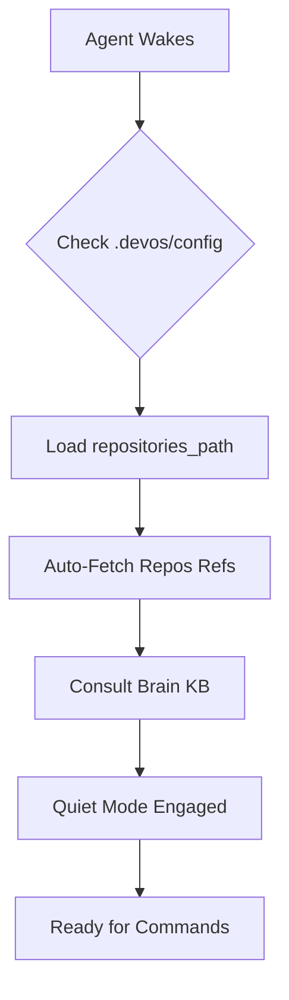

<div align="center">

# DevOS
**The Filesystem-First Autonomous Development Framework (v2)**

[](https://opensource.org/licenses/MIT)
[](CHANGELOG.md)

</div>

## The Problem

AI coding assistants are powerful, but they lack persistent context. Every new chat session starts with amnesia. Developers waste hours copy-pasting tickets, finding relevant slack threads, and explaining the project architecture over and over.

**DevOS solves this** by acting as an orchestrator that lives in your filesystem. It creates a unified, accumulative memory ("Brain KB") and drives development using structured workflows, parallel skills, and universal verification.

## Key Features

- **Skills-Based Architecture**: 10 self-contained skills enabling parallel execution and rapid context gathering.
- **DAG-Based Planning**: Implementation plans use Directed Acyclic Graphs (DAGs) for dependency tracking and efficient multi-agent execution.
- **Quiet by Default**: Framework runs silently, analyzing and verifying in the background. Verbose output is opt-in.
- **Local-First Resolution**: DevOS resolves everything locally before reaching out to APIs, saving time and tokens.
- **Multi-Tool Native Support**: First-class configurations for Claude, Cursor, Windsurf, Codex, and Copilot.
- **Accumulative Memory (Brain KB)**: It remembers your project conventions, ADRs, and past mistakes.
- **Digest History**: Daily context summaries stored securely in `memory/digests/YYYY-MM-DD/`.
- **Universal Verification**: All code changes are reviewed, built, linted, and tested automatically.

## Quick Start

1. **Initialize the workspace:**
   Create a `.devos` folder in your root project directory.
   ```bash
   mkdir -p .devos/config
   ```

2. **Run Setup:**
   Prompt your preferred AI assistant with `/devos.setup`.
   The assistant will use a wizard-based flow to configure your `repositories_path` and integrations.

3. **Start the Engine:**
   Run `/devos.start`. Subagents will spawn in parallel to ingest data from Jira, Slack, GitHub, and local repos.

## How It Works

### Boot Sequence


### `/devos.start` (Parallel Execution)
```mermaid
graph TD
    A[/devos.start] --> B[Orchestrator]
    B --> C[Spawn Subagents]
    C --> D[Skill: source_jira]
    C --> E[Skill: source_slack]
    C --> F[Skill: source_github]
    C --> G[Skill: source_local_repos]
    D --> H[Digest Fusion]
    E --> H
    F --> H
    G --> H
    H --> I[Update Brain KB]
```

### `/devos.develop` (DAG-Based Flow)
```mermaid
graph TD
    A[/devos.develop] --> B[Planner Agent]
    B --> C[Generate Execution DAG]
    C --> D[Task Layer 1]
    C --> E[Task Layer 2]
    D --> F[Reviewer Verification]
    E --> F
    F --> G[Commit & Push]
```

## Commands

DevOS uses a command-style syntax. You invoke these in your AI chat interface.

| Command | Description |
|---|---|
| `/devos.setup` | Runs the wizard-based configuration and aggressive KB auto-indexing. |
| `/devos.init` | Quick workspace context load without external ingestion. |
| `/devos.start` | Spawns parallel agents to pull external context (Jira, Slack, etc.) and fuses digests. |
| `/devos.update` | Incremental context refresh — only re-ingests what changed. |
| `/devos.develop` | Triggers the DAG-based Planner and begins coding. |
| `/devos.review` | Explicitly triggers the universal Reviewer Agent on specific changes. |

## Architecture

DevOS lives directly in your filesystem. 

```text
.devos/
├── config/
│   ├── state.json           # Active workspace state
│   └── integrations.yaml    # MCP mappings
├── memory/
│   ├── brain/               # Accumulative Knowledge Base
│   └── digests/             # History of daily context fusions
├── skills/                  # Self-contained AI capabilities
│   ├── source_jira.md
│   ├── planning.md
│   └── ...
├── scripts/                 # Python helper scripts for data processing
└── workflows/               # High-level orchestration docs
.claude/                     # Native tool folders
.cursor/
.windsurf/
.codex/
```

## The Skills System

DevOS v2 introduces a robust Skills System. Every capability is an independent, self-contained Markdown file inside `.devos/skills/`. 
When `/devos.start` is invoked, the Orchestrator reads these files and dispatches parallel subagents to execute them. Skills handle data extraction, planning, reviewing, and verification.

## Personas

1. **Orchestrator**: The bootloader. It handles configuration, tool delegation, and context fusion.
2. **Planner**: Transforms context into actionable Execution DAGs (Directed Acyclic Graphs).
3. **Reviewer**: Universally activated. Reviews every code change against the Brain KB and triggers verification steps (lint/build/test).

## Brain KB (Accumulative Memory)

The Brain KB isn't just vector search. It's a structured markdown graph inside `.devos/memory/brain/`. The Orchestrator automatically consults it before making decisions, ensuring it never repeats past mistakes and strictly adheres to your documented ADRs (Architecture Decision Records).

## Desktop App

DevOS includes an optional Electron-based Control Plane. It provides a GUI for visualizing the Execution DAGs, checking the Repo Status Table, and managing integrations without touching configuration files.

## Extending DevOS

DevOS is endlessly extensible:
- **Adding Skills**: Create a new `.md` file in `.devos/skills/`. Define the inputs, the required tools, and the output format.
- **Adding Knowledge**: Simply drop markdown files, wikis, or docs into the workspace. The aggressive auto-indexer will find them during `/devos.setup knowledge` or `/devos.update`.
- **MCP Servers**: Configure new Model Context Protocol servers in `.devos/config/integrations.yaml` to connect internal tools.

## Multi-Tool Support

DevOS v2 injects itself gracefully into whatever editor you use:
- **Cursor**: Uses `.cursor/rules/` for lightweight entry points that bootstrap the DevOS orchestrator.
- **Windsurf**: Uses `.windsurf/rules/` to ensure native autocomplete aligns with DevOS workflows.
- **Claude Desktop**: Uses `.claude/commands/` to map DevOS CLI commands natively.
- **GitHub Copilot / Codex**: Injects project conventions automatically into the context window.

*No aggressive prompt injection. DevOS waits to be invoked.*

## Comparison

| Feature | Plain AI Assistant | DevOS v2 |
|---|---|---|
| Context | Current Chat Only | Persistent Brain KB + Multi-Source Fusions |
| Planning | Linear step-by-step | Parallel DAG-based execution |
| Verifications | Manual ("Please run tests") | Universal Auto-Verification |
| External Tools | Limited to Plugins | Extensible Skills & MCP |

## Philosophy

Code is cheap. Context is expensive. DevOS focuses entirely on maintaining, retrieving, and effectively utilizing context so that the AI can write code that actually works in your specific environment. 

## Contributing

We welcome pull requests! Please read `CONTRIBUTING.md` for details on our code of conduct, and the process for submitting pull requests to us.

## License

This project is licensed under the MIT License - see the `LICENSE` file for details.
